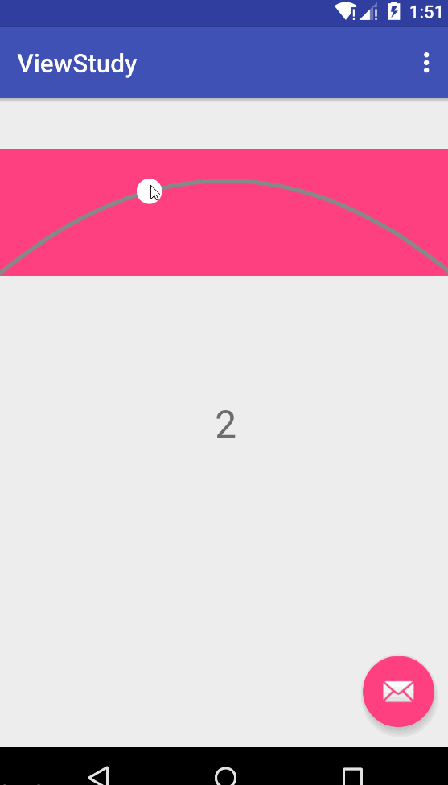

自定义弧形SeekBar



## Gradle
```
compile 'com.android.lovesixgod.customarcseekbar:library:1.0.0'
```

## Maven
```
<dependency>
  <groupId>com.android.lovesixgod.customarcseekbar</groupId>
  <artifactId>library</artifactId>
  <version>1.0.0</version>
  <type>pom</type>
</dependency>
```

## Usage
```
<com.android.lovesixgod.library.ArcSeekBarParent
    android:id="@+id/seek_bar"
    android:layout_width="match_parent"
    android:layout_height="100dp"
    android:layout_marginTop="40dp"
    android:background="@color/colorAccent"
    app:arcColor="#000000"
    app:arcWidth="3dp"
    app:ballColor="#00ffff"
    app:ballSize="30dp" />
```

```
ArcSeekBarParent seekBar = (ArcSeekBarParent) findViewById(R.id.seek_bar);
seekBar.setListener(new ArcSeekBarParent.OnProgressChangedListener() {
    @Override
    public void OnProgressChanged(int level) {
        textView.setText(String.valueOf(level));
    }
});
```

[更多详细说明](http://lastwarmth.win/2016/04/27/seekbar/)
